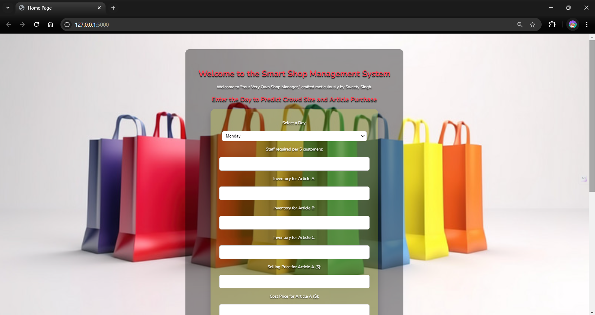
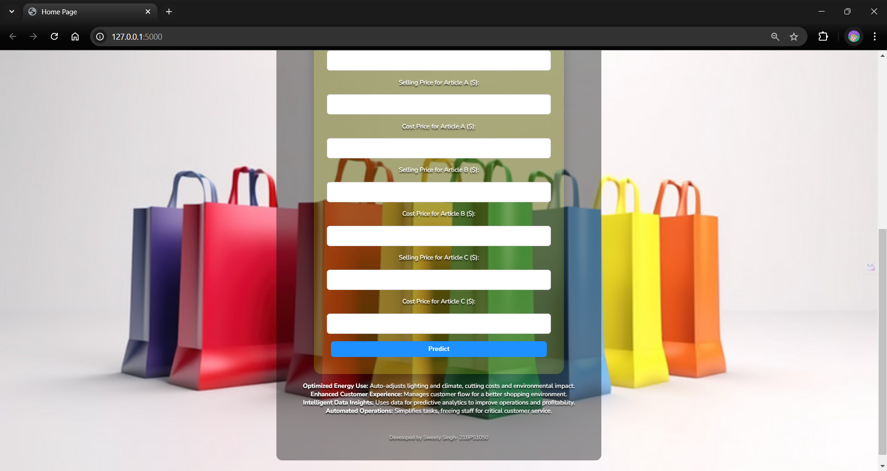
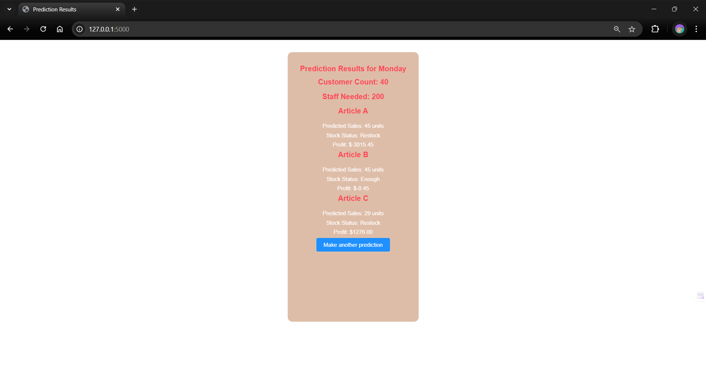
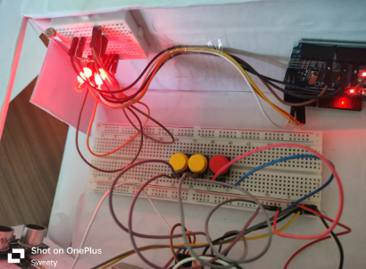
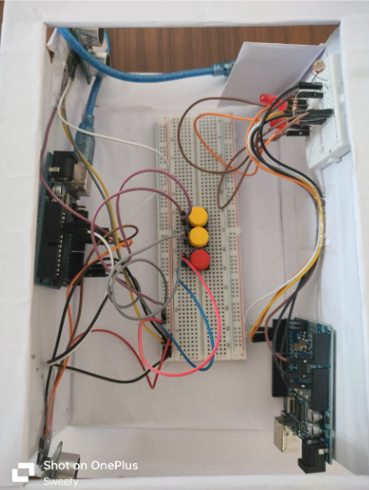
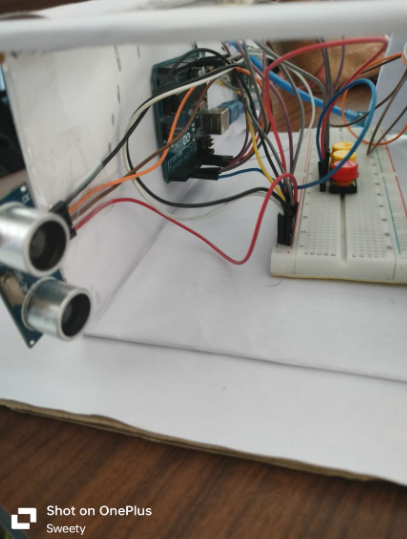

---

# Smart Shop Management and Environment Optimization System

## Overview

This project integrates hardware and software to enhance retail management by using AI and sensor technology. It predicts inventory needs, ensures constant shelf stocking, and optimizes in-store environmental conditions based on customer traffic data.

## Features

### AI-Driven Inventory Prediction

- Uses various regression models like RandomForest, GradientBoosting, AdaBoost, ExtraTrees, DecisionTree, and XGBoost to predict inventory needs.
- Helps prevent overstocking, reduces waste, and predicts potential loss based on cost and selling prices.
- The best model achieved an accuracy of **71.34%**.

### Customer Traffic Prediction

- Predicts daily customer visits using Linear Regression, enabling better inventory planning.

### Environmental Optimization

- Sensors adjust lighting and temperature in real-time based on customer presence, saving energy when the store is empty.

## How It Works

### Data Collection

- Sensors gather data on customer traffic, environmental conditions, and inventory levels.

### AI Processing

- AI models process the data to predict inventory needs and customer visits.

### Real-Time Adjustments

- Environmental sensors optimize lighting and temperature based on real-time data.

### Inventory Management

- Alerts for low stock levels to ensure timely restocking.

## Installation

### Hardware Setup

- Install sensors in key locations and connect them to the central processing unit.
  

### Software Setup

- Clone the repository:
  ```bash
  git clone https://github.com/sweetyysinghh/Efficient-Shop-Management-System
  ```
- Install dependencies:
  ```bash
  pip install -r requirements.txt
  ```
- Configure the AI models with your store's data.
### Demonstration Images
## Software
## 
## 
## 
## Hardware
## 
## 
## 

## Usage

- The system begins making predictions and adjustments automatically upon deployment.
- Access the dashboard to monitor inventory, customer traffic, and environmental conditions.

## Contact

For support, please contact [singhh.sweetyy@gmail.com](mailto:singhh.sweetyy@gmail.com).

---
